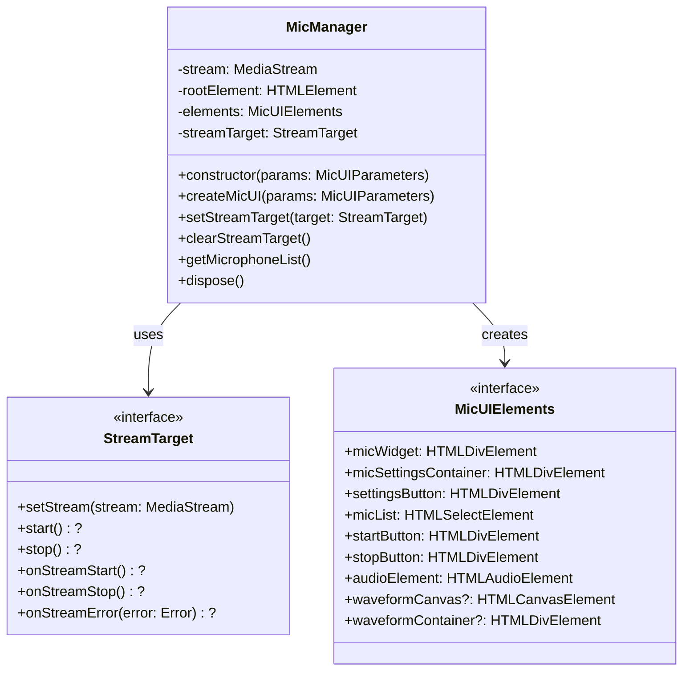

# MicManager Documentation

The MicManager is a TypeScript library (v2025.4.19) that provides a comprehensive interface for managing microphone input, audio recording, and waveform visualization in web applications. It offers a customizable UI component with microphone selection, recording controls, and real-time audio visualization.

## Table of Contents

- [Features](#features)
- [Installation](#installation)
- [Basic Usage](#basic-usage)
- [Architecture](#architecture)
- [Interfaces](#interfaces)
- [API Reference](#api-reference)
- [Examples](#examples)
- [Error Handling](#error-handling)
- [Browser Support](#browser-support)
- [Development](#development)

## Features

- 🎤 Microphone device selection and management
- 🎚️ Audio recording controls with start/stop functionality
- 📊 Real-time waveform visualization with configurable parameters
- 🎯 Custom stream target support for advanced audio processing
- 🎨 Fully customizable UI elements with theming support
- 🔄 Automatic microphone list updates with caching
- ⚡ Efficient event handling and automatic resource cleanup
- 🔒 Built-in error handling and type safety with TypeScript
- 📱 Responsive design with mobile device support

## Installation

```bash
npm install @julianfrank/opensource
```

## Basic Usage

First, import the MicManager class:

```typescript
import { MicManager } from '@julianfrank/opensource';
```

Then create a new instance and initialize the UI:

```typescript
// Create a new MicManager instance with default settings
const micManager = new MicManager({
    rootElement: document.getElementById('mic-container'),
    startButtonText: '🎙️ Start',
    stopButtonText: '⏹️ Stop',
    onStartRecording: (stream) => {
        console.log('Recording started', stream);
    },
    onStopRecording: () => {
        console.log('Recording stopped');
    }
});

// Initialize the UI with waveform visualization
micManager.createMicUI({
    waveform: {
        enabled: true,
        width: 300,
        height: 150,
        backgroundColor: '#000000',
        waveformColor: '#00ff00',
        resolution: 32,
        refreshRate: 30
    }
});

// Optional: Customize the appearance
micManager.setStyle({
    backgroundColor: '#f0f0f0',
    waveformColor: '#ff0000',
    waveformBackgroundColor: '#333333',
    buttonBackgroundColor: '#ffffff',
    buttonShadowColor: 'rgba(0,0,0,0.3)',
    micListBackgroundColor: '#ffffff',
    micListBorderColor: '#cccccc'
});
```

## Architecture



## Interfaces

### MicUIParameters

```typescript
interface MicUIParameters {
    rootElement?: HTMLElement;              // Container element for the UI
    streamTarget?: StreamTarget;            // Custom audio stream handler
    onMicListChange?: (mics: Microphone[]) => void;  // Microphone list update callback
    onStartRecording?: (stream: MediaStream) => void; // Recording start callback
    onStopRecording?: () => void;          // Recording stop callback
    onAudioElementChange?: (audio: HTMLAudioElement) => void;
    onAudioElementError?: (error: Error) => void;
    startButtonText?: string;               // Custom start button text
    stopButtonText?: string;                // Custom stop button text
    waveform?: WaveformConfig;             // Waveform visualization config
}
```

### StreamTarget

```typescript
interface StreamTarget {
    // Required method
    setStream(stream: MediaStream | null): void;
    
    // Optional methods
    start?(): void;
    stop?(): void;
    
    // Optional event handlers
    onStreamStart?(): void;
    onStreamStop?(): void;
    onStreamError?(error: Error): void;
}
```

### WaveformConfig

```typescript
interface WaveformConfig {
    enabled?: boolean;           // Enable/disable waveform visualization
    width?: number;             // Canvas width in pixels
    height?: number;            // Canvas height in pixels
    resolution?: number;        // FFT size / 2
    refreshRate?: number;       // Updates per second
    backgroundColor?: string;   // Canvas background color
    waveformColor?: string;    // Waveform line color
}
```

### Microphone

```typescript
interface Microphone {
    deviceId: string;   // Unique device identifier
    label: string;      // Human-readable device name
}
```

## API Reference

### Constructor

```typescript
constructor(params: MicUIParameters)
```

Creates a new MicManager instance. Only one instance can exist at a time.

### Methods

#### createMicUI

```typescript
createMicUI(params: MicUIParameters): MicUIElements
```

Creates and returns the UI elements for microphone management.

#### setStreamTarget

```typescript
setStreamTarget(target: StreamTarget): void
```

Sets a custom stream target for handling the audio stream.

#### clearStreamTarget

```typescript
clearStreamTarget(): void
```

Removes the custom stream target and reverts to using the default audio element.

#### getMicrophoneList

```typescript
async getMicrophoneList(): Promise<Microphone[]>
```

Returns a list of available microphone devices.

#### dispose

```typescript
dispose(): void
```

Cleans up resources and removes UI elements.

#### toggleMicSettings

```typescript
toggleMicSettings(enabled: boolean): void
```

Enables or disables the microphone settings interface.

#### toggleWaveform

```typescript
toggleWaveform(enabled: boolean): void
```

Enables or disables the waveform visualization. If disabled while recording, the waveform will stop; if enabled while recording, the waveform will start.

#### setStyle

```typescript
setStyle(styles: {
    backgroundColor?: string;
    waveformColor?: string;
    waveformBackgroundColor?: string;
    buttonBackgroundColor?: string;
    buttonShadowColor?: string;
    micListBackgroundColor?: string;
    micListBorderColor?: string;
}): void
```

Sets custom styles for various UI components. All parameters are optional:
- `backgroundColor`: Background color of the main widget
- `waveformColor`: Color of the waveform line
- `waveformBackgroundColor`: Background color of the waveform canvas
- `buttonBackgroundColor`: Background color of all buttons
- `buttonShadowColor`: Shadow color for all buttons
- `micListBackgroundColor`: Background color of the microphone selection dropdown
- `micListBorderColor`: Border color of the microphone selection dropdown

## Examples

### Basic Recording with Waveform

```typescript
const micManager = new MicManager({
    rootElement: document.getElementById('mic-container')
});

const ui = micManager.createMicUI({
    startButtonText: '🎙️ Start',
    stopButtonText: '⏹️ Stop',
    waveform: {
        enabled: true,
        width: 300,
        height: 150,
        resolution: 32,
        refreshRate: 30,
        backgroundColor: '#000000',
        waveformColor: '#00ff00'
    },
    onStartRecording: (stream) => {
        console.log('Recording started');
    },
    onStopRecording: () => {
        console.log('Recording stopped');
    }
});
```

### Custom UI Configuration

```typescript
const micManager = new MicManager({
    rootElement: document.getElementById('mic-container')
});

const ui = micManager.createMicUI({
    startButtonText: '🎙️ Start',
    stopButtonText: '⏹️ Stop',
    waveform: {
        enabled: true,
        width: 300,
        height: 150
    }
});

// Customize the appearance
micManager.setStyle({
    backgroundColor: '#f0f0f0',
    waveformColor: '#ff0000',
    waveformBackgroundColor: '#333333',
    buttonBackgroundColor: '#ffffff',
    buttonShadowColor: 'rgba(0,0,0,0.3)',
    micListBackgroundColor: '#ffffff',
    micListBorderColor: '#cccccc'
});

// Toggle UI components
micManager.toggleMicSettings(true);  // Show mic settings
micManager.toggleWaveform(false);    // Hide waveform

// Later, when recording starts
micManager.toggleWaveform(true);     // Show waveform during recording
```

### Custom Stream Target

```typescript
class AudioProcessor implements StreamTarget {
    private audioContext: AudioContext;
    private processor: ScriptProcessorNode;

    constructor() {
        this.audioContext = new AudioContext();
    }

    setStream(stream: MediaStream | null): void {
        if (stream) {
            const source = this.audioContext.createMediaStreamSource(stream);
            source.connect(this.processor);
        }
    }

    start(): void {
        console.log('Processing started');
    }

    stop(): void {
        console.log('Processing stopped');
    }

    onStreamError(error: Error): void {
        console.error('Stream error:', error);
    }
}

const micManager = new MicManager({
    rootElement: document.getElementById('mic-container'),
    streamTarget: new AudioProcessor()
});

micManager.createMicUI({
    waveform: { enabled: true }
});
```

## Error Handling

The MicManager provides custom error types for better error handling:

```typescript
// Base error type
class MicManagerError extends Error {
    name = "MicManagerError";
}

// Stream-related errors
class StreamError extends MicManagerError {
    name = "StreamError";
}

// Device-related errors
class DeviceError extends MicManagerError {
    name = "DeviceError";
}

// Error handling example
try {
    await micManager.startRecording();
} catch (error) {
    if (error instanceof StreamError) {
        console.error('Stream error:', error.message);
    } else if (error instanceof DeviceError) {
        console.error('Device error:', error.message);
    } else {
        console.error('Unknown error:', error);
    }
}
```

## Development

### Prerequisites

- Node.js (Latest LTS version recommended)
- npm or yarn

### Setup

1. Clone the repository
2. Install dependencies:
```bash
npm install
```

### Available Scripts

- `npm run dev` - Start development server with hot reload
- `npm run build` - Build for production
- `npm run preview` - Preview production build

### Dependencies

- TypeScript 5.8.3
- Vite 6.3.2
- @vitejs/plugin-basic-ssl 2.0.0
- vite-plugin-css-injected-by-js 3.5.2

## Best Practices

1. **Singleton Usage**: Only one MicManager instance should exist at a time.
2. **Resource Cleanup**: Always call `dispose()` when the MicManager is no longer needed.
3. **Error Handling**: Implement proper error handling using the provided error types.
4. **Stream Target**: Use custom stream targets for advanced audio processing.
5. **Waveform Configuration**: Adjust waveform settings based on performance requirements.
6. **Mobile Support**: Test on various devices and screen sizes.
7. **Memory Management**: Properly dispose of instances to prevent memory leaks.

## Browser Support

MicManager requires browsers that support:
- `MediaDevices` API
- `getUserMedia`
- Web Audio API
- Canvas API

Supported Browsers:
- Chrome (latest)
- Firefox (latest)
- Safari (latest)
- Edge (latest)

## License

This project is licensed under the MIT License.


